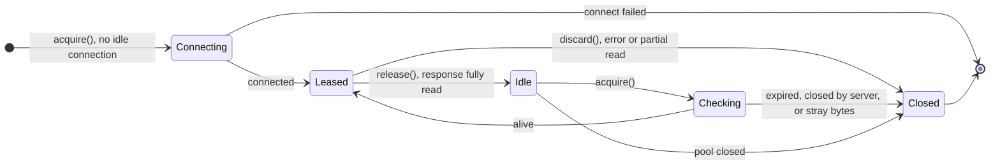

# connection-pool

Reproducing and fixing a real production incident: a Java service calling
another service on the same machine **ran out of ephemeral ports** and started
failing with `java.net.BindException: Cannot assign requested address`, while
CPU, memory and the downstream service were all healthy.

This repo reproduces the failure in Docker, explains the root cause, fixes it
with a hand-rolled connection pool, and measures the fix against Jetty's
production HTTP client and against the usual kernel-tuning workaround.

| At 1,000 requests/s for 150 s | Failed calls | Ports stuck in TIME_WAIT | p99 latency |
|---|---|---|---|
| New connection per request (the incident) | **71,731** of 150,000 | 28,231 (all of them) | — |
| Hand-rolled connection pool | **0** | 7 | 3.17 ms |
| Jetty `HttpClient` | 0 | 24 | 3.57 ms |
| Kernel workaround (`tcp_tw_reuse=1`) | 0 | 14,045 | 4.94 ms |

**The root cause is the rate of new connections outpacing how fast the kernel
can reclaim ports, not a missing library.** A pool fixes it because the number
of connections then follows the pool size instead of the request rate.

## What happened

Service A called service B over `localhost` once per incoming request, opening
a brand-new TCP connection each time and closing it right after.

- Each outgoing connection needs its own **ephemeral port**, a temporary port
  number the OS assigns. Linux hands out 28,232 of them by default.
- When A closes a connection, that port isn't free yet. It stays in the TCP
  state **TIME_WAIT for 60 seconds**, so stray packets from the old connection
  can't leak into a new one.
- So A can open about 28,232 ÷ 60 ≈ **470 new connections per second** to B,
  however powerful the machine is. Above that rate for long enough, every port
  is in TIME_WAIT and `connect()` fails.

A plain-language version with an analogy is in
[docs/OVERVIEW.md](docs/OVERVIEW.md); the full technical write-up, with the math
and every measurement, is in [docs/BACKGROUND.md](docs/BACKGROUND.md).

### Why localhost didn't protect us

Modern Linux would have hidden this bug. The setting `net.ipv4.tcp_tw_reuse`
lets the kernel reuse a TIME_WAIT port after about 1 second instead of 60:

| `tcp_tw_reuse` | Behavior | Where |
|---|---|---|
| `0` | Never reuse: the full 60 s wait | Ubuntu 18.04's kernel 4.15: **the incident** |
| `1` | Reuse after ~1 s, for all traffic | Opt-in |
| `2` | Reuse after ~1 s, **localhost only** | Default on newer kernels |

Reuse is safe because of TCP timestamps: a new connection's timestamps are
always higher, so the kernel can recognize late packets from the old one. The
incident machine predated mode `2`, so localhost got the full 60 seconds. The
reproduction emulates that by setting `tcp_tw_reuse=0` on a modern kernel.
[`scripts/kernel-smoke.sh`](scripts/kernel-smoke.sh) shows every combination
in about a minute, with no Java involved.

## Results

All four scenarios ran back to back in one run, at 1,000 requests/s for 150 s
each, with the default port range. Charts are generated from the raw data in
[`results/`](results/) by [`scripts/plot.py`](scripts/plot.py).


With a new connection per request, ports fill up at about 1,000 per second and
hit the limit at about 30 s. The pool and Jetty's client keep a handful of
connections open and reuse them, so TIME_WAIT stays near zero.


The failure isn't a one-time outage. Once the first TIME_WAITs expire at about
60 s, ports free up at the rate they were used, so the service works for about
30 s and then fails again. On average it lands near the ~470/s limit.


The kernel workaround stops the errors, but every request still pays for a
TCP handshake and teardown. That shows up as higher latency (p90 is 2× the
pool's) and as CPU on the **server**: B needs about 3× the CPU because it
accepts and tears down 1,000 connections per second.

| Scenario | OK | Errors | Peak TIME_WAIT | Max open connections | A CPU | B CPU | p50 | p90 | p99 |
|---|---|---|---|---|---|---|---|---|---|
| before (fresh, `tw_reuse=0`) | 78,269 | 71,731 | 28,231 | – | 66% | – | 0.86 ms* | – | 3.56 ms* |
| pool (ours, max 32) | 149,998 | 0 | 7 | 12 | 29% | 8% | 0.55 ms | 1.34 ms | 3.17 ms |
| jetty (`HttpClient`, max 32) | 150,057 | 0 | 24 | 20 | 37% | 8% | 0.71 ms | 1.57 ms | 3.57 ms |
| mitigation (fresh, `tw_reuse=1`) | 149,997 | 0 | 14,045 | 3 | 32% | 25% | 0.88 ms | 2.84 ms | 4.94 ms |

CPU is the average % of one core during the load. \* `before` includes
fast-failing errors, which pull its percentiles down. Numbers come from one
run on a laptop shared with other containers: compare scenarios within the
table rather than reading the absolute values as exact (they moved by up to
about ±50% between runs).

## The fix: a connection pool

[`pool/`](pool/src/main/java/dev/connpool/pool/) is about 200 lines of plain
Java with no dependencies. Each destination (`host:port`) gets:

- a **fair `Semaphore`** with `maxPerRoute` permits, one per connection in
  use. When all are taken, callers either wait up to a timeout or fail
  immediately, depending on configuration;
- a **stack of idle connections**, reused most-recent-first so a few stay warm
  and the rest age out;
- a **health check on every checkout**: a non-blocking 1-byte read that
  detects a connection the server has closed, or one with leftover bytes from
  a previous response, without adding latency.

A caller returns a connection with `release()` only after reading the
response completely. Anything else (an error, a partial read, the server
asking to close) goes through `discard()`, so no caller can ever read another
caller's response.



## Mitigation vs. fix

| Option | Effect | Why it isn't the fix |
|---|---|---|
| Widen `ip_local_port_range` | At most ~2× more headroom | Still a rate limit: ports ÷ 60 s |
| `tcp_tw_reuse=1` | Limit becomes ports ÷ ~1 s | A handshake per request: more latency, ~3× server CPU here |
| `tcp_tw_recycle` | — | Broke clients behind NAT; removed in Linux 4.12 |
| `SO_LINGER` 0 (close with RST) | Skips TIME_WAIT | Throws away TIME_WAIT's protection; risks data loss |
| **Reuse connections** (pool / keep-alive) | Connections ≈ pool size | **The fix** |

In production you'd simply configure Jetty's `HttpClient` (or any other
keep-alive client) and create it once. The hand-rolled pool is here to show
what such a client does inside, and the results show it holds up.

## Run it yourself

Requirements: Docker, Java 25 and bash. Built and run on macOS with OrbStack.

```bash
./mvnw verify                          # 21 unit and integration tests
scripts/run-all.sh                     # all four scenarios with a live terminal dashboard (~16 min)
DURATION=30s scripts/run-all.sh pool   # a quick look (~1.5 min)
scripts/kernel-smoke.sh                # the failure with socat only, no Java (~1 min)
python3 scripts/plot.py                # regenerate the charts from results/
```

| Path | What it is |
|---|---|
| `service-a/`, `service-b/` | The two Jetty 12 services. A's client is chosen with `CLIENT=fresh\|pool\|jetty` |
| `pool/` | The connection pool |
| `http-mini/` | A minimal HTTP/1.1 client over a raw socket, so no library pools connections behind our back |
| `docker/` | One image; A shares B's network namespace so they talk over real loopback |
| `scripts/` | Load runs, the dashboard, the socat reproduction, the charts |
| `results/` | Raw measurements behind every number above |

## Honest notes

- **The old kernel is emulated**: a modern kernel (7.0) with
  `tcp_tw_reuse=0`, not a real Ubuntu 18.04 / 4.15 machine.
- **One run, one laptop.** Scenarios are comparable within a run; absolute
  numbers vary between runs.
- **The pool covers what this project needs**: HTTP/1.1, `Content-Length`
  bodies, one route. Jetty's client does far more.
